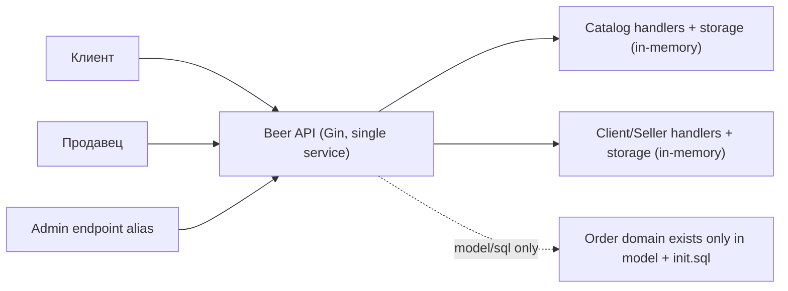
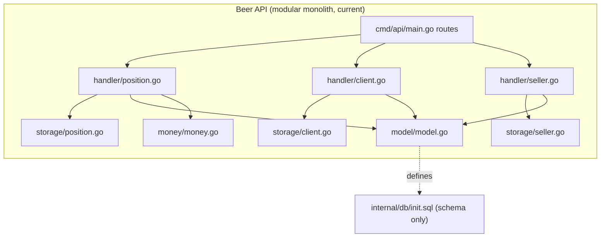
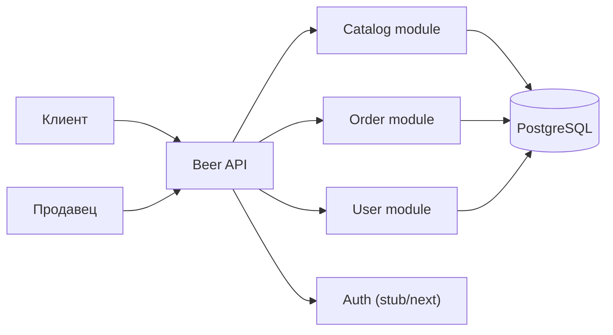
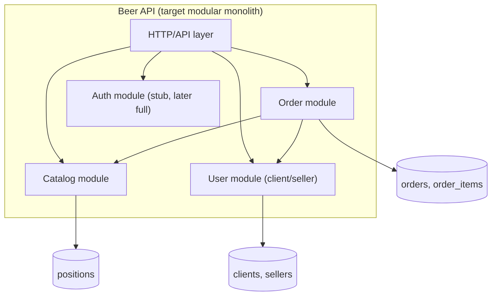
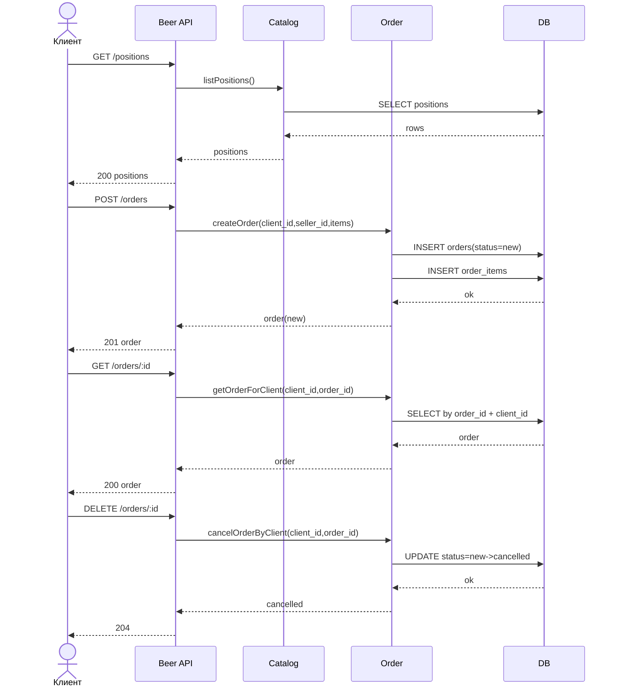
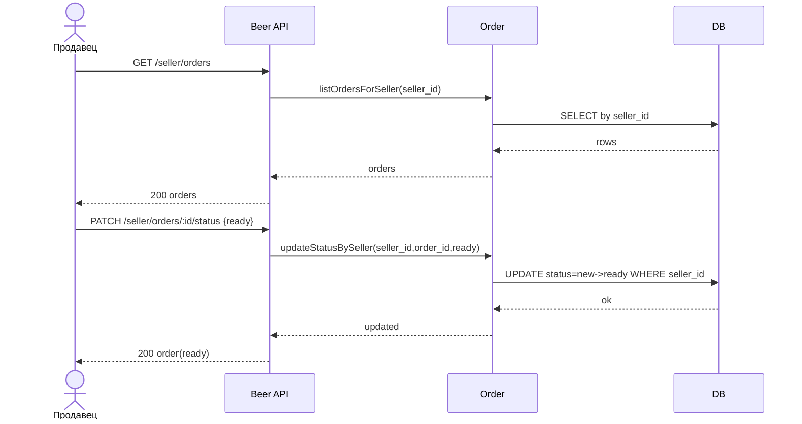
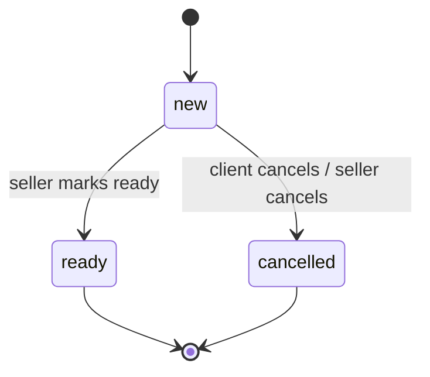

# BA-схема Beer API: As-Is + To-Be (MVP заказов)

## 1) Summary
Этот документ фиксирует:
- `As-Is`: фактическое текущее состояние сервиса по коду.
- `To-Be`: целевую бизнес-логику заказа (MVP) в модульном монолите.
- Переход: что и в каком порядке добавить, чтобы прийти к To-Be без поломки текущих CRUD.

## 2) As-Is (по текущему коду)

### 2.1 Контексты и границы
- `Catalog`: позиции (`positions`), CRUD через HTTP.
- `User`: клиенты (`clients`) и продавцы (`sellers`), CRUD через HTTP.
- `Orders`: есть в доменных моделях и SQL-схеме, но нет в handler/storage/main.go.

### 2.2 Текущие API
- `Positions`: `GET /positions`, `GET /positions/:id`, `POST /positions`, `PATCH /positions/:id`, `DELETE /positions/:id`
- `Clients`: `GET /clients`, `GET /clients/:id`, `POST /clients`, `PATCH /clients/:id`, `DELETE /clients/:id`
- `Sellers`: `GET /sellers`, `GET /sellers/:id`, `POST /sellers`, `PATCH /sellers/:id`, `DELETE /sellers/:id`
- `Admins` (alias продавца): `GET /admins`, `GET /admins/:id`, `POST /admins`, `PATCH /admins/:id`, `DELETE /admins/:id`

### 2.3 Хранилище и данные
- Runtime-хранилище: in-memory slices в `internal/storage/*`.
- Инициализация каталога: 2 дефолтные позиции в памяти.
- SQL-схема содержит таблицы: `positions`, `clients`, `sellers`, `orders`, `order_items`.

### 2.4 Явный gap
- В `internal/model/model.go` и `internal/db/init.sql` есть `Order`/`OrderItem`.
- В HTTP-слое и storage-слое нет заказов, статусов и order-flow.

### 2.5 As-Is Context Diagram


### 2.6 As-Is Container/Module Diagram


## 3) To-Be (MVP заказа)

### 3.1 Роли
- `Клиент`: смотрит позиции, создает заказ, видит только свои заказы, отменяет свой заказ в допустимом статусе.
- `Продавец`: управляет позициями, видит входящие заказы, меняет статус заказа `new -> ready|cancelled`.
- `Система`: валидирует ACL, статусы и целостность данных.

### 3.2 Статусы заказа
- `new`: заказ создан клиентом, доступен продавцу для обработки.
- `ready`: заказ готов, клиент уже не может отменить.
- `cancelled`: отменен клиентом (до `ready`) или продавцом по бизнес-правилу.

### 3.3 ACL (MVP)
- Клиент:
  - Может `GET /positions`, `GET /positions/:id`.
  - Может `POST /orders` для себя.
  - Может `GET /orders`, `GET /orders/:id` только для своих заказов.
  - Может `DELETE /orders/:id` только для своего заказа в статусе `new`.
- Продавец:
  - Может CRUD по позициям.
  - Может `GET /seller/orders`, `GET /seller/orders/:id` для своих входящих заказов.
  - Может `PATCH /seller/orders/:id/status` с переходом `new -> ready|cancelled`.
- Система:
  - Запрещает чтение/изменение чужих заказов.
  - Запрещает недопустимые переходы статусов.

### 3.4 Целевые API-контракты (MVP)
#### Client API
- `GET /positions` - список позиций каталога.
- `GET /positions/:id` - позиция по ID.
- `POST /orders` - создать заказ.
  - Тело: `client_id`, `seller_id`, `items[{position_id, quantity}]`
  - Результат: созданный заказ со статусом `new`.
- `GET /orders` - список только своих заказов.
- `GET /orders/:id` - деталь только своего заказа.
- `DELETE /orders/:id` - отмена только своего заказа, если статус `new`.

#### Seller API
- `GET /seller/orders` - список входящих заказов продавца.
- `GET /seller/orders/:id` - деталь заказа продавца.
- `PATCH /seller/orders/:id/status` - смена статуса.
  - Тело: `status = ready | cancelled`
  - Правило: только из `new`.
- CRUD `/positions` - управление каталогом.

### 3.5 To-Be Context Diagram


### 3.6 To-Be Module Diagram (Modular Monolith)


### 3.7 ER/Domain Diagram
```mermaid
erDiagram
    CLIENTS ||--o{ ORDERS : places
    SELLERS ||--o{ ORDERS : receives
    ORDERS ||--|{ ORDER_ITEMS : contains
    POSITIONS ||--o{ ORDER_ITEMS : references

    CLIENTS {
      uuid id PK
      string name
      string phone
      string email
      string login UNIQUE
      string password_hash
      timestamptz created_at
      timestamptz updated_at
    }

    SELLERS {
      uuid id PK
      string name
      string login UNIQUE
      string password_hash
      timestamptz created_at
      timestamptz updated_at
    }

    POSITIONS {
      uuid id PK
      string name
      string description
      string image_url
      float size_liters
      int quantity
      bigint price_minor_units
      timestamptz created_at
      timestamptz updated_at
    }

    ORDERS {
      uuid id PK
      uuid client_id FK
      uuid seller_id FK
      string status "new|ready|cancelled"
      timestamptz created_at
      timestamptz updated_at
    }

    ORDER_ITEMS {
      uuid id PK
      uuid order_id FK
      uuid position_id FK
      int quantity
      bigint price_minor_units
    }
```

### 3.8 Client Order Sequence


### 3.9 Seller Processing Sequence


### 3.10 Order State Diagram


## 4) Переход от As-Is к To-Be (без ломки текущего CRUD)
1. Добавить `order` модуль в код (handler + storage/repo + service), не изменяя существующие `positions/clients/sellers` endpoints.
2. Подключить `orders` API:
- Клиентский контур: `POST/GET/DELETE /orders`.
- Продавец: `GET /seller/orders`, `GET /seller/orders/:id`, `PATCH /seller/orders/:id/status`.
3. Вынести проверки в бизнес-слой:
- ACL на владельца заказа/продавца.
- Валидные переходы статусов.
- Проверка существования клиента, продавца, позиции.
4. Перевести storage c in-memory на PostgreSQL через существующую `init.sql` схему.
5. Добавить auth-заглушку (identity через header/контекст), чтобы не блокировать внедрение ACL.
6. Сохранить обратную совместимость существующего каталога и user CRUD на этапе миграции.

## 5) Границы будущего микросервисного разделения
- `Catalog Service`: позиции и остатки.
- `Order Service`: заказ, позиции заказа, статусы.
- `User/Auth Service`: клиенты, продавцы, аутентификация и роли.
- На текущем этапе это остаются модули внутри одного приложения с явными контрактами.

## 6) Проверка артефакта (Test Plan)
### 6.1 Проверка As-Is
- Все текущие endpoints и in-memory storage отражены как есть.
- Gap по `orders` явно указан (есть в модели/SQL, отсутствует в API-flow).

### 6.2 Проверка To-Be MVP
- Покрыты flow клиента и продавца.
- Для каждого статуса определены допустимые переходы.
- Для каждого endpoint указан actor, доступ и ожидаемый результат.

### 6.3 Acceptance критерии
- Все Mermaid-диаграммы рендерятся без ошибок.
- По документу можно реализовать order-модуль без продуктовых догадок.
- Виден последовательный путь миграции от текущего состояния к целевому.

## 7) Assumptions
- Формат: `Mermaid + текст`.
- Охват: `As-Is + To-Be`.
- Архитектура: модульный монолит с подготовкой к микросервисам.
- Глубина: MVP заказа без оплаты, доставки и складского резерва.
- Auth: фиксируется как требование и ACL-слой, без детализации протокола (JWT/OAuth) на этом шаге.
